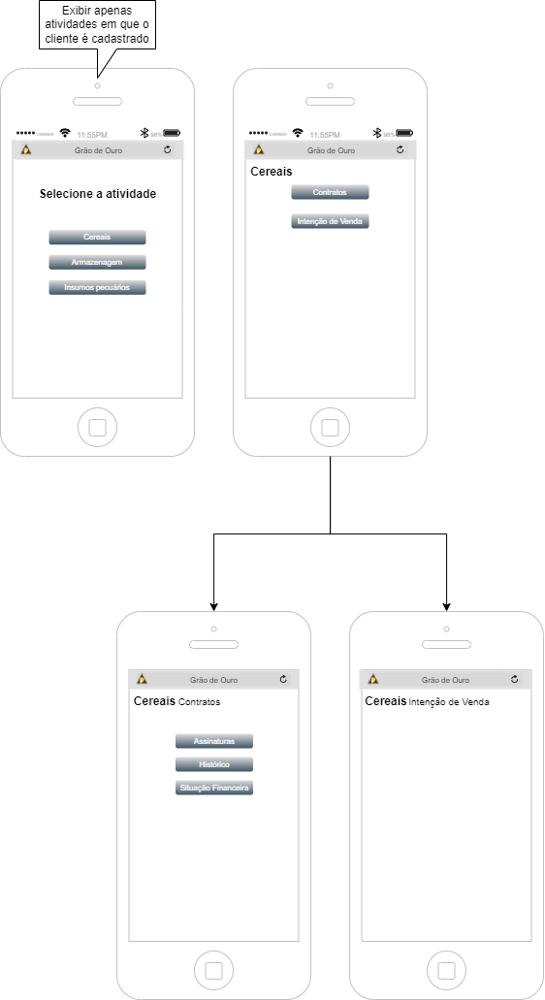

# Hugo Leonardo Terra de Oliveira

Alfenas, Minas Gerais, Brazil  
+55-35-98875-7779  
<hugo@tce.dev.br>  

## Projects and Skills

### My position, company, relevant projects and stacks with more technical content

### 1. Architect/Developer at Grão de Ouro Group

Initially i was hired to develop an e-commerce. After scoped all the requirements i propouse to develop a point of sale with back-office area from scratch because e-commerce is too much for and they have some specific rules that must be developed like bindery production, storage of products and raw materials, bonification, goals, logistics (internal/external).

To challenge up, each area has its own system and must be integrate with the solution.  ♨️♨️♨️

>## Nutrimax
>
>

>
>**- Back-end language:** C#;
>
>**- Front-end:** Responsive AdminLTE template for mobile, tablets and TV´s using Razor, HTML5, CSS3, Javascript, Jquery, Polly, NPM.
>
>**- Database:** SQL Server with entity framework core, dapper, sql queries and stored procedures.
>
>**- Patterns:** MVC, Unit-Of-Work, Repository, Generics, DDD (Domain Driven Design).
>
>**- Identity:** OpenID specifications mixed with Active Directory.
>
>**- APIs:** netCore, OAS3 (Open API Specification).
>
>**- Logs:** Serilog.
>
>**- Reports:** Report Server Integration MSSQL, Syncfusion.
>
>**- Tests:** Unit Tests with xUnit, Integration, load and stress testing.
>
>### **POS (Point of sale):**
>
> Area for comercial sector and representatives to collect orders. Based on his/her permissions, its possible to choose price catalogs with filters.
>
>### **Back-office:**
>
> Area for CEO, managers, directors, heads and back office team to parametrize, control and management the whole system with hierach policies for manufacturing, comercial,  packing and logistics.
>
>**Background process:**
>
> I´ve created some robots to do background services likes automatic order analysis, if is approved, put the order in queue to be integrate with the ERP.
>
>
>**3th Party Integrations:**
>
>- ERP Agrotis: Directly SQL queries (To acomplished this was necessary to make a profiler in database to capture and understand queries);
>- ViaCEP: REST API to search for address in Brazil;
>- Sendgrid: E-mail and SMS sender;
>- Wiki.js: System for documentation;
>
>
This first solution tooks 6 months to go live and more 6 months to finished all ajustments with new features.

>## S2GO
>
>Upon completing the Nutrimax project, the group decided to create a new project to centralize how data is collected and cross-share for different sectors between the whole group. And themmm surges S2GO (System Group Grão de Ouro)...
>
>

>
>The pourpose of S2GO is to provide an environment for colaborators to automate daily work process and centralize data information to process and treat to be used by each company/sectors with their own rules.
>I can´t show detailed diagrams due to NDA but in the image bellow you can see a solution macro view.
>
>

>
>The solution was created using the best practices of clean architecture for microservices with CQRS, Option, Generics, Msg. Brokers and Repository patterns.
>
>### **- Front-end:**
>
>Responsive layout for mobile, tablets and TV´s using Blazor with Syncfusion framework, HTML5, CSS3, Javascript
>
>### **Customer Portal:**
>
>The first solution was a centralized platform for customers to register with custom template layout for each company.
>
>Here the commercial team can shared custom temporary links to a form for customers to update and validate they profiles or register an account.
>
>To enable this proccess, the commercial team contact each customer to get they principal e-mail and mobile number to send the links.
>
>
>### **Back-office:**
>
>The back office was separated by company routes where each company has it own setup, layout and rules.
>
>The common process shared between all of them is third-party integrations and each company has his own class library encapsulating all process.
>
>
>### **API´s:**
>
>**- Gateway:**
>
>I´ve used Ocelot to implement a basic API Gateway. The image bellow show how the gateways works just treat service as company API.
>
>

>
>
>**- Identity:**
>
>Cross-shared API between each company to management user, permissions, rules and policies.
>
>OpenID Pattern using Microsoft Identity Framework with Bearer Token authentication and integration with Active Directory.
>
>

>
>
>**- Clientes (Customers):**
>
>Cross-shared API between each company to management customers.
>
>**- Nutrimax:**
>
>Migration the Nutrimax API (.netCore 3) to work with same core (.netCore 6) and configuration patterns.
>
>**- "Companies":**
>
>Each company was it own API to deal with specific proccess and rules.
>
>### **Hangfire Proccess Management:**
>
>All background process was migrated to hangfire escalate, monitoring and run independently.
>
>### **Mobile App:**
>
>I´ve develop a mobile app to customer sign digital contracts and check their products stored in warehouse.
>To develop i used Xamarin Platform with MVVM pattern, DryIoc for IoC and Refit to do REST request.
>
>

>
>### **3th Party Integrations:**
>
>- ERP Agrotis: Directly SQL query (To acomplished this was necessary to make a profiler in database to understand and capture queries);
>- ViaCEP: REST API to search address in Brazil for free;
>- D4Sign: REST API to create digital contracts (Use of webhooks);
>- SintegraWS: REST API
>- Wiki.js: System documentation;
>- Sendgrid: E-mail and SMS sender;

---

### 2. Senior Web Developer at Cresça Brasil (Owned by Uol Education)

In Cresça Brasil i´ve been part of Research and Development team and i was responsible to develop many important systems like:
Project Management Portal (internal), a chatbox using SignalR to use in telemarketing system and a private high available streaming video using AWS cloud services.
And this last one i consider one of my biggest challenges.

>## Private high availability streaming videos with AWS
>
>I work as tech-lead in this specific project. I´ve worked together with a Infrastructure specialist to create a solution to store online courses and make available for students. This is a generic player where we can add in any page from our customers and have seven layers of security.
>The main goal in stream is cut in small buffer sizes and send to client making it practically impossible to downlaod the files.
>
>**- Back-end language:** C#;
>
>**- Front-end:** Responsive layout for mobile, tablets and TV´s using Asp.net, Javascript and CSS;
>At that time there were no front-end frameworks libraries so the entire page was developed with pure HTML and CSS for each device.
>
>**- Database:** SQL Server with entity framework.
>
>**- Patterns:** MVC, Repository, Factory.
>
>
>**3th Party Integrations:**
>
>- AWS: S3 Storage, Firewall, EC2 and Lambda;
>- JWplayer: Private player to render streams;
>

---

### 3. Senior Fullstack Developer at Iterative

Iterative is a Software Factory in Sao Paulo and it was one of the first companies to release remote work. I was one of those employees.

>## Linked Gourmet (Food Services)
>
>The project was divide in three teams: two development (back-office and cashier) and one support. I was the principal senior developer in back-office development team.
>The solution model is SaaS (Software as a service) using microservices pattern and message broker.
>
>## Back-Office
>
> Web client portal to configure, monitoring and maintain restaurant.
>
>**- Patterns:** MVVM, Generics, Repository, Factory;
>
>**- Back-end language:** C#;
>
>**- Front-end:** Responsive layout for mobile, tablets and TV´s using HTML, Javascript, CSS and Knockout framework;
>
>**- Database:** SQL Server with entity framework, sql queries and stored procedures.
>
>
>**- 3th Party Integrations:**
>
>- Azure: Storage, Service Bus;
>
>## Sync
>
> Exec to syncronize data between back-office and Cashier.
>
>## Cashier
>
> Local API Server to run disconected from internet and mobile interfaces for waiters and desktop to cashier.
>
>**- Patterns:** CQRS, DDD, Mediator, Command and Observer.
>
>**- Back-end language:** C#;
>
>**- Front-end:** Responsive layout for mobile, tablets and TV´s using Angular, Javascript and Bootstrap;
>
>**- Database:** SQLite with entity framework.
>
>
>**3th Party Integrations:**
>
>- Azure: Storage, Service Bus;
>- Payment Gateways: Stone, MundiPagg;
>- Online Menu: iFood;
>
>
